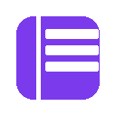
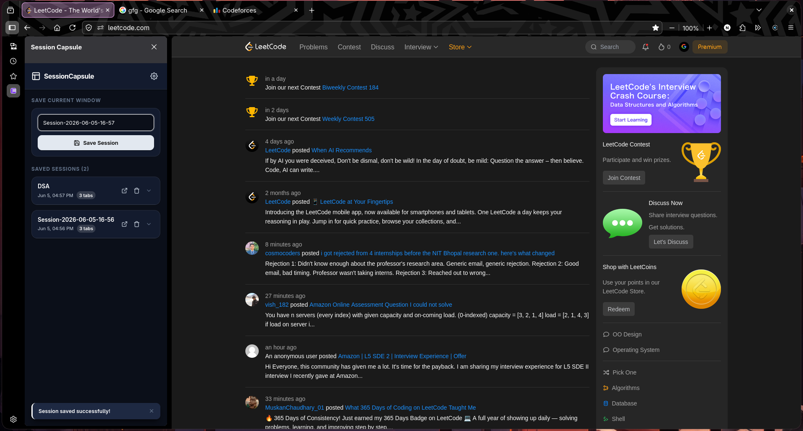
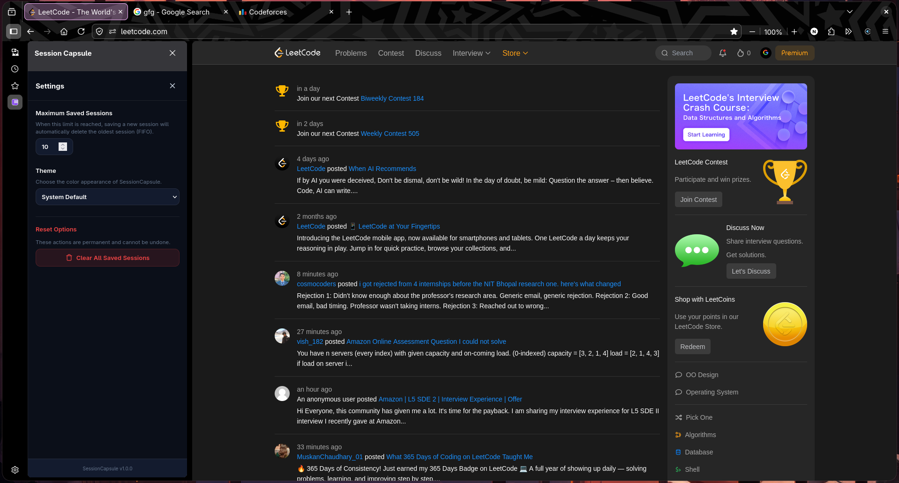
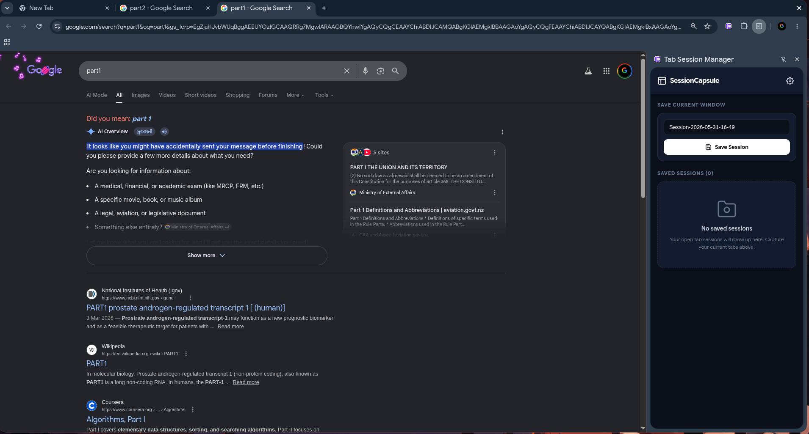
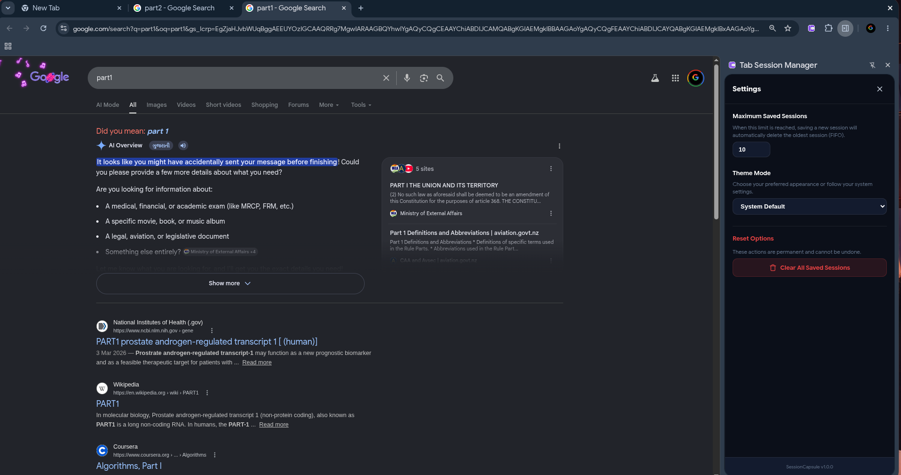

<p align="center">
  
</p>

# SessionCapsule (Tab Session Manager)

SessionCapsule is a simple, flat, monochromatic browser extension that allows you to capture, organize, and restore your active window tab sessions directly from the browser sidebar.

<p align="center">
  <a href="https://addons.mozilla.org/en-US/firefox/addon/sessioncapsule/">
    
  </a>
</p>

## Features

- **Sidebar Integration**: Opens instantly via the browser's Side Panel/Sidebar API when clicking the toolbar action icon.
- **Save Current Window**: Save all active tabs in the current window with a single click. Default names are generated using the `Session-YYYY-MM-DD-HH-MM` format, or you can supply a custom name.
- **Easy Restore**: Click the restore icon on any saved session card to reopen all tabs in that session instantly, or expand the card details to click and launch individual links.
- **Persistent Storage**: Session data and settings are stored locally on your machine via standard extension storage.
- **FIFO Session Limits**: Set a limit on the maximum number of sessions saved. The extension automatically discards the oldest session (FIFO) once the limit is exceeded.
- **Monochromatic Styling**: Features a clean, distraction-free flat monochromatic design (pure black and white styling, no gradients, no glassmorphism).
- **Light & Dark Theme Control**:
  - Automatically matches browser/system theme preferences by default.
  - Can be manually overridden inside Settings to stay strictly in **Light Mode** or **Dark Mode**.

## Preview & Demo
### For FireFox
<p align="center">
  
  &nbsp;&nbsp;&nbsp;&nbsp;
  
</p>

### For Chrome
<p align="center">
  
  &nbsp;&nbsp;&nbsp;&nbsp;
  
</p>


### Walkthrough Video
Here is a quick walkthrough showing how to download, install, and use the extension:

### For FireFox
<video src=".img/preview.mp4" controls muted width="800" height="500" align="center">
</video>

### For Chrome
<video src=".img/preview1.mp4" controls muted width="800" height="500" align="center">
</video>

## Project Structure

```text
├── manifest.json          # Extension Manifest v3 config
├── background.js          # Service worker setting side panel click behavior
├── sidebar.html           # Main Sidebar UI structure
├── sidebar.js             # Client-side extension controller logic
├── sidebar.css            # Monochromatic UI styling & theme overrides
├── icons/                 # Extension toolbar and brand icons
└── .img/                  # Extension preview and demo assets
```

## How to Install

### Firefox
You can install the reviewed, ready-to-use version directly from the Firefox Add-ons store:
1. Visit [SessionCapsule on Firefox Add-ons](https://addons.mozilla.org/en-US/firefox/addon/sessioncapsule/).
2. Click **Add to Firefox** and grant the required permissions.

### Chrome 
To run the extension in Google Chrome or any Chromium-based browser (Brave, Edge, Opera):
1. Clone or download this repository to your local machine.
  ```bash
  git clone https://github.com/Nitesh4546/Sessions-Capsule.git
  ```
2. Open your browser and navigate to `chrome://extensions/`.
3. Enable **Developer mode** using the toggle switch in the top-right corner.
4. Click the **Load unpacked** button in the top-left corner.
5. Select the folder containing this extension's files (where `manifest.json` is located).
6. Pin the extension to your toolbar, click the icon, and start capturing tab sessions!
